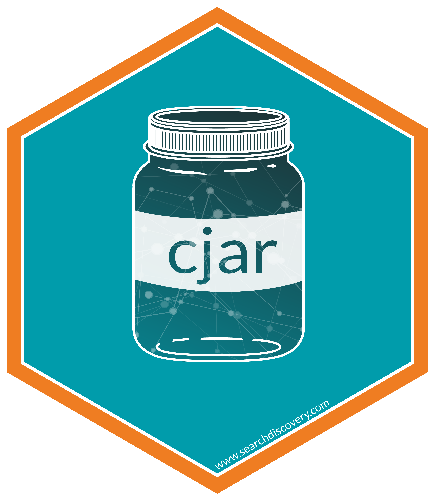

<!-- README.md is generated from README.Rmd. Please edit that file -->

# cjar

<!-- badges: start -->

<!-- badges: end -->

## An R Client for the CJA API

Connect to the CJA API, which powers CJA Workspace. The package was
developed with the analyst in mind and will continue to be developed
with the guiding principles of iterative, repeatable, timely analysis.
New features are actively being developed and we value your feedback and
contribution to the process. Please submit bugs, questions, and
enhancement requests as [issues in this Github
repository](https://github.com/searchdiscovery/cjar/issues).

### Install the package (recommended)

    # Install from CRAN
    install.packages('cjar')

    # Load the package
    library(cjar)

### Install the development version of the package

    # Install devtools from CRAN
    install.packages("devtools")

    # Install adobeanayticsr from github
    devtools::install_github('searchdiscovery/cjar') 

    # Load the package
    library(cjar) 

### Current setup process overview

There are four setup steps required to start accessing your Customer
Journey Analytics data. The following steps are each outlined in greater
detail in the following sections:

1.  Create an Adobe Console API Project
2.  Create and add the JWT arguments to your `.Renviron` file.
3.  Get your authorization token by using the function `cja_auth()`.
4.  Get the `Data View ID` by using the function `cja_get_dataviews()`.

#### 1. Create an Adobe Console API Project

When using JWT authentication, you only need an Adobe Console API
project for each organization you are needing to access.

Once you are a developer for a CJA product profile, you can create an
API client in the Adobe Developer Console.

1.  Navigate to console.adobe.io.
2.  Check the organization name in the top right to make sure that you
    are logged in to the correct company.
3.  Click Create new project.
4.  Click Add API.
5.  Click Customer Journey Analytics, then click Next.
6.  Click Generate Keypair.
7.  A config.zip file is automatically downloaded to your local machine.
    Keep this config folder in a secure location, as it contains your
    only copy of your private key. See steps … for what to do with the
    private.key file.
8.  Click Next.
9.  Select the desired product profiles for the service account. Make
    sure that it contains the right permissions to access the API. Click
    Save configured API.
10. Back on the project’s home page, click Add to project > API.
11. Click Adobe Experience Platform, then click Next.
12. You already generated a keypair when creating the Adobe Analytics
    API, so you do not need to create another. Click Next.
13. Select the desired product profiles for the service account. Make
    sure that it contains the right permissions to access the API. Click
    Save configured API.
14. Click on “Service Account (JWT)” under “CREDENTIALS” in the left
    column. Locate the “Download JSON” button on the top right and click
    it to download the service account JSON file. Alternatively, you can
    manually create this file by copying and pasting the Client ID,
    Client Secret (click “Retrieve client secret”), Technical Account
    ID, and Organization ID into a `.json` file. Reference `?cja_auth`
    for more information on the variables needed. Using the
    preconfigured JSON file is the easiest method.
15. Locate the config.zip file that automatically downloaded in step 6.
    Unzip the file and move the ‘private.zip’ to your desired location.
    The location of this file will be needed as the value of the
    **CJA_PRIVATE_KEY** variable.

#### 2. Set up the .Renviron file

This file is essential to keeping your information secure. It also
speeds up analysis by limiting the number of arguments you need to add
to every function call.

1.  If you do not have an `.Renviron` file (if you have never heard of
    this file you almost certainly don’t have one!), then create a new
    file and save it with the name `.Renviron`. You can do this from
    within the RStudio environment and save the file either in your
    `Home` directory (which is recommended; click on the **Home** button
    in the file navigator in RStudio and save it to that location) *or*
    within your project’s working directory. You can also use the
    [“usethis”](https://usethis.r-lib.org/reference/edit.html) package
    to create the file by running the function
    `edit_r_environ(scope = "user")`
2.  Add the 2 variables, listed below, to the `.Renviron` file using the
    file location path for both, the json (auth) file and the private
    key file. The format of variables in the `.Renviron` file is
    straightforward.

<!-- -->

    ## JWT creds ##
    CJA_AUTH_FILE=filelocation.json
    CJA_PRIVATE_KEY=private.key

After adding these 2 variables to the `.Renviron` file and saving it,
restart your R session (**Session \> Restart R** in RStudio) and reload
the package (`library(cjar)`).

#### 3. Get your access token

The token is actually a lonnnnng alphanumeric string that is the what
ultimately enables you to access your data:

1.  In the console, enter `cja_auth()` and press *Enter*.
2.  In the Console window you should see “Successfully authenticated
    with JWT: access token valid until ….”
3.  If you do not see this message then go back and repeat the previous
    steps to make sure you did not miss something.

#### 4. Get the Data View ID

All data in CJA is located in Data Views, similar to Report Suites in
Adobe Analytics. Before pulling data it is essential to locate the data
view id you are attempting to pull from.

    #Pull a list of available data views

    dv <- cja_get_dataviews(expansion = c('name', 'description')) 

    #note: see function documentation for all availabe expansion metadata available.

Once you have the data view ID you want then you can begin pulling data
using the different functions.
